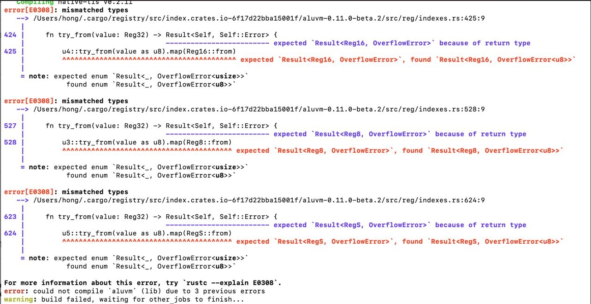
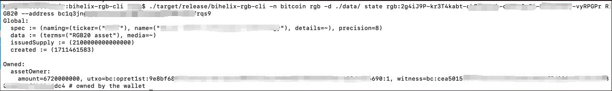

# BiHelix RGB CLI
Introducing the revolutionary RGB command-line tool, meticulously crafted by the BiHelix Team. Leveraging the power of the Bitcoin Development Kit and the latest rgb v0.11 libraries, this tool empowers users to seamlessly import, export, issue, and inquire about their off-chain RGB20 assets. 

# Features
KV based database, rocksdb is supported here.

# Notes
Now the developer can use this cli to perform rgb asset with `import contract`, `issue rgb20 asset`, `transfer asset`, and `query asset` operations.

# Requirements
Before run this repo, please check whether or not your `rust` version satisfy `1.76`, if not, please update it to the `1.76` version(Or the latest stable version).

# Installation
Clone the repo from the github and compile it.
```bash
git clone https://github.com/bihelix-io/bihelix-rgb-cli
cd bihelix-rgb-cli
cargo build --release
cd ./target/release
```

# Troubleshoot
## amplify_num issue
Encountering the error shown in the image, please run `sudo cargo update amplify_num --precise 0.5.1` then, run `sudo cargo build --release` again.


# Usage
## Generate Key
```bash
./target/release/brgb key generate
```
# Output
```bash
{
  "fingerprint": "0ce460a0",
  "xprv": "tprv8ZgxMBicQKsPf6A3Li9Yn7Q2X27ytZUncjZFxfjBd3rhhqFrXtzhWsTAswsuYrq52uB2KnqbGWpufieeSvfyYXSw85kgKp4vgfnwiLkWwpf",
  "xpub": "tpubD6NzVbkrYhZ4YZBqEMp9BX4963dv3tfhC3A3FBmV3Kf6YKWdAHpHhN53488TZvdeR7r497rcJ38LdUbiMC4bKR8zZAA1hA6rmdbtCMzyL3e"
}
```
## Generate BiHelix RGB Wallet
```bash
./target/release/brgb key generate-wallet -d wpkh -x tprv8ZgxMBicQKsPf6A3Li9Yn7Q2X27ytZUncjZFxfjBd3rhhqFrXtzhWsTAswsuYrq52uB2KnqbGWpufieeSvfyYXSw85kgKp4vgfnwiLkWwpf --stock bhlx_stock --wallet bhlx_wallet
```
# Output
```bash
success
generate bihelix done
"done"
```

## Generate Bitcoin address
```bash
./target/release/brgb -n testnet rgb -d <stock> -w <wallet> -p <private key> -s <electrum> address
```
# Output
```
address "tb1qe98ry2v5ftz9x7v0j8lrqlska3vhrg8jmwvk3s" 
```

## Issue Rgb20 Asset
```bash
./target/release/brgb -n testnet rgb -d <stock> -w <wallet> -p <private key> -s <electrum> issue "test" "test" 1000 1000 "opret"
```
```
Syncing keychain 0 .......... keychain 1 .......... keychain 9 ........... keychain 10 .......... success
success
Balance of wpkh([0ce460a0/86h/1h/0h]tpubDCn9MV3NmMQsKuSXCYDLtMPSqE2weZ3aNxkvT6GAKYTDKYwD5bvzH2xU47XBUfAc7r8Z847t2JH8ueLvcQc1pmofjJE86ScTe2888tYUgD6/<0;1;9;10>/*) 

Balance Sats(3990) 


Height     Amount, ṩ    Outpoint                                                            
Address { payload: Wpkh(WPubkeyHash(Array<20>(c94e3229944ac453798f91fe307e16ec5971a0f2))), network: Testnet }     Terminal { keychain: Keychain(9), index: NormalIndex(0) }
Mined(3005811)          3990    c7b40a11181aed8461f99d80756ac90140eb4424ced0d2779479adac76947232:2

import kit status Status { failures: [], warnings: [], info: [] }
A new contract rgb:qA5j5J48-8mkf3Rc-XvFuCH6-3xN02e7-di6gFL6-a1jJMjY is issued and added to the database.
```
## Query the RGB20 asset
Execute query cmd as followed.
```bash
./target/release/brgb -n testnet rgb -d <stock> -w <wallet> -p <private key> -s <electrum> state <contract id> "RGB20Fixed"
```
```
Global:
  spec := (ticker=("bhlx"), name=("bhlx"), details=~, precision=2)
  terms := (text=(""), media=~)
  issuedSupply := (10000)

Owned:
  assetOwner:
    amount=10000, utxo=bc:opret1st:c7b40a11181aed8461f99d80756ac90140eb4424ced0d2779479adac76947232:2, witness=None # owned by the wallet
Balance of wpkh([0ce460a0/86h/1h/0h]tpubDCn9MV3NmMQsKuSXCYDLtMPSqE2weZ3aNxkvT6GAKYTDKYwD5bvzH2xU47XBUfAc7r8Z847t2JH8ueLvcQc1pmofjJE86ScTe2888tYUgD6/<0;1;9;10>/*)
Balance Sats(3990)

Height     Amount, ṩ    Outpoint                                                            
Address { payload: Wpkh(WPubkeyHash(Array<20>(c94e3229944ac453798f91fe307e16ec5971a0f2))), network: Testnet }     Terminal { keychain: Keychain(9), index: NormalIndex(0) }
Mined(3005811)          3990    c7b40a11181aed8461f99d80756ac90140eb4424ced0d2779479adac76947232:2
```
## Balance of RGB20 Asset
